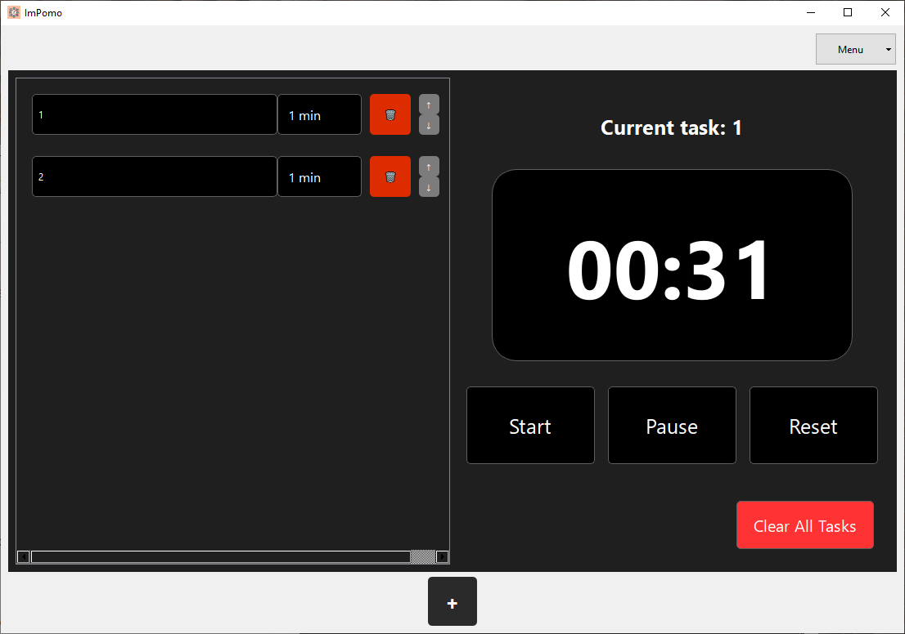
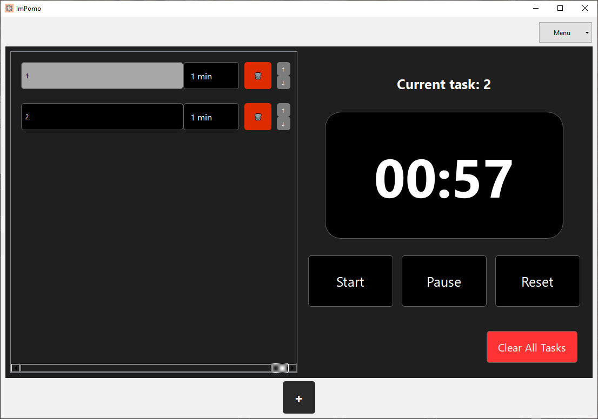
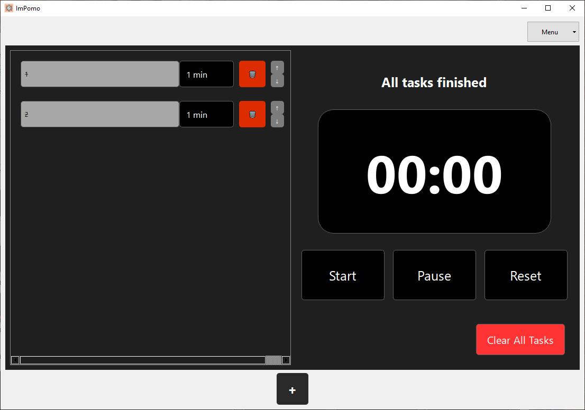

> _"Jako użytkownik chcę, aby aplikacja automatycznie rozpoczynała kolejne zadanie po zakończeniu poprzedniego, żebym nie musiał ręcznie ustawiać timera."_

---

### **1. Automatyczne przełączenie pomiędzy zadaniami (happy path)**

**Stan początkowy aplikacji:**  
Lista zadań w ImPomo jest pusta.

**Kroki testowe:**
1. Dodanie do listy dwóch zadań i przypisanie im czasu trwania (1 min każde).
2. Uruchomienie timera.
3. Odczekanie na zakończenie pierwszego zadania.

**Oczekiwany rezultat testu:**  
Po zakończeniu odliczania aplikacja automatycznie zaczyna odliczanie czasu dla kolejnego zadania oraz aktualizuje etykietę **"Current task"**.

**Rzeczywisty rezultat testu:**  
*aplikacja automatycznie przeszła do nastepnego zadania i zaktualizowala etykiete*

  

  

**Rezultat testu (zaliczony / niezaliczony):**  
*zaliczony*

**Stan końcowy aplikacji:**  
Timer aktywny, trwa odliczanie dla drugiego zadania. Pierwsze zadanie jest zaznaczone na szaro.

---

### **2. Brak kolejnego zadania – przejście przez całą listę (scenariusz alternatywny)**

**Stan początkowy aplikacji:**  
Lista zadań w ImPomo jest pusta.

**Kroki testowe:**
1. Uruchomienie timera.
2. Dodanie do listy dwóch zadań i przypisanie im czasu trwania (1 minuta każde).
3. Odczekanie na zakończenie odliczania obu zadań.

**Oczekiwany rezultat testu:**  
Po zakończeniu zadania aplikacja nie odlicza czasu (brak kolejnego zadania), ale prawidłowo kończy sesję – etykieta nad zegarem powinna pokazywać komunikat **"All tasks finished"** (ewentualnie **"No tasks on the list"**).

**Rzeczywisty rezultat testu:**  
*komunikat all tasks finished, timer sie zatrzymal*

  

**Rezultat testu (zaliczony / niezaliczony):**  
*zaliczony*

**Stan końcowy aplikacji:**  
Wszystkie zadania na liście zaznaczone na szaro, odpowiednia etykieta widoczna, zegar wyzerowany.
