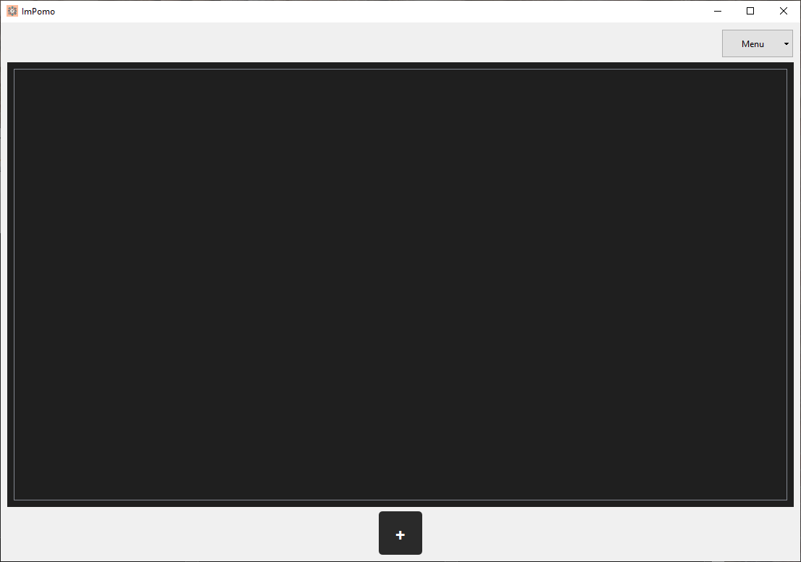
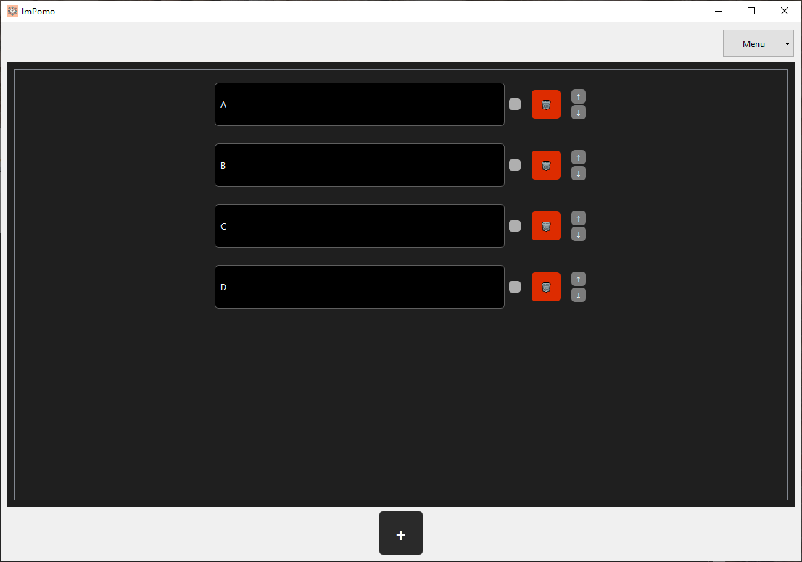
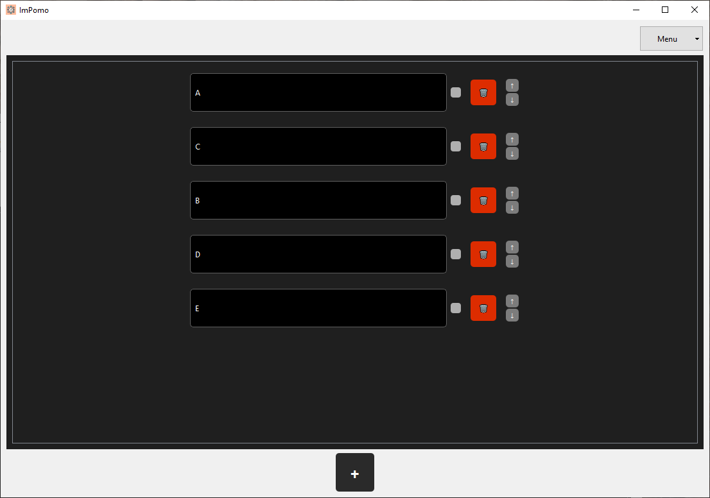
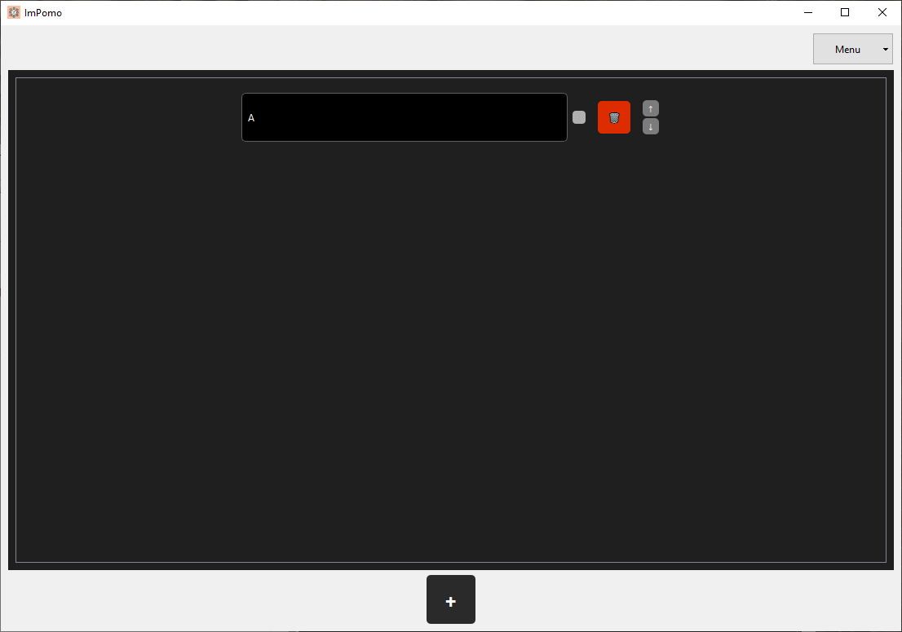

> _„Jako użytkownik chcę móc dodawać, usuwać i zmieniać kolejność poszczególnych pozycji w liście zadań, aby móc nią elastycznie zarządzać.”_

---

### **1. Kompleksowe zarządzanie listą – dodawanie, zmiana kolejności, usuwanie (happy path)**

**Stan początkowy aplikacji:**  
Lista zadań To-do jest pusta.

**Kroki testowe:**
1. Dodanie zadania o nazwie **"1"** za pomocą przycisku **+**. Analogiczne dodanie zadań: **"2"**, **"3"**, **"4"**.
2. Sprawdzenie kolejności (**1, 2, 3, 4**).
3. Przeniesienie zadania **"4"** na samą górę listy przy użyciu strzałek (kolejność: **4, 1, 2, 3**).
4. Usunięcie zadania **"4"**. (**1, 2, 3**)
5. Przeniesienie zadania **"1"** na koniec listy.
6. Sprawdzenie finalnej kolejności.

**Oczekiwany rezultat testu:**  
Lista zadań zawiera trzy zadania w kolejności: **2, 3, 1**.

**Rzeczywisty rezultat testu:**  

  

  

  

**Rezultat testu (zaliczony / niezaliczony):**  
*zaliczony*

**Stan końcowy aplikacji:**  
Lista zawiera odpowiednią liczbę zadań w poprawnej kolejności: **2, 3, 1**.

---

### **2. Próba zmiany kolejności z jednym zadaniem (scenariusz alternatywny)**

**Stan początkowy aplikacji:**  
Lista zawiera jedno zadanie **"1"**.

**Kroki testowe:**
1. Próba przesunięcia zadania za pomocą strzałek.

**Oczekiwany rezultat testu:**  
Aplikacja ignoruje operację.

**Rzeczywisty rezultat testu:**  
*nic sie nie stalo*

  

**Rezultat testu (zaliczony / niezaliczony):**  
*zaliczony*

**Stan końcowy aplikacji:**  
Lista z jednym zadaniem, bez zmian.
