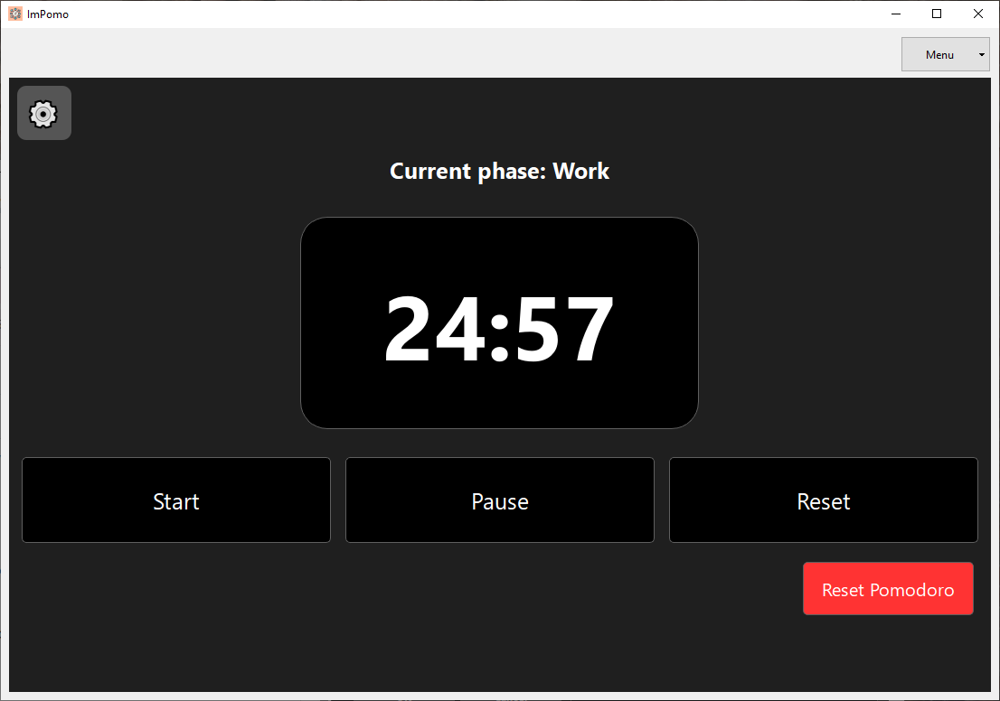

> _"Jako użytkownik chcę móc uruchomić klasyczny licznik Pomodoro z domyślnym czasem 25 minut pracy i 5 minut przerwy, aby pracować w skupieniu bez konieczności planowania zadań."_

---

### **1. Uruchomienie klasycznego Pomodoro z domyślnymi ustawieniami (happy path)**

**Stan początkowy aplikacji:**  
Tryb Pomodoro, ustawienia domyślne:
- Czas pracy: 25 minut  
- Krótka przerwa: 5 minut  
- Długa przerwa: 15 minut  

**Kroki testowe:**
1. Upewnienie się, że zegar ustawiony jest na 25 minut oraz że ustawienia są zgodne z domyślnymi.
2. Zmiana czasu pracy na 1 minutę.
3. Kliknięcie przycisku **Start** w trybie Pomodoro.
4. Oczekiwanie na zakończenie odliczania.
5. Sprawdzenie, czy aplikacja automatycznie przechodzi do 5-minutowej przerwy.

**Oczekiwany rezultat testu:**  
Aplikacja domyślnie ustawia 25 minut pracy. Po zakończeniu bloku pracy automatycznie uruchamia 5-minutową przerwę bez konieczności ingerencji użytkownika.

**Rzeczywisty rezultat testu:**  
*taki sam jak oczekiwany*

  

**Rezultat testu (zaliczony / niezaliczony):**  
*zaliczony*

**Stan końcowy aplikacji:**  
Tryb: krótka przerwa, licznik ustawiony na 5:00 i aktywny.
