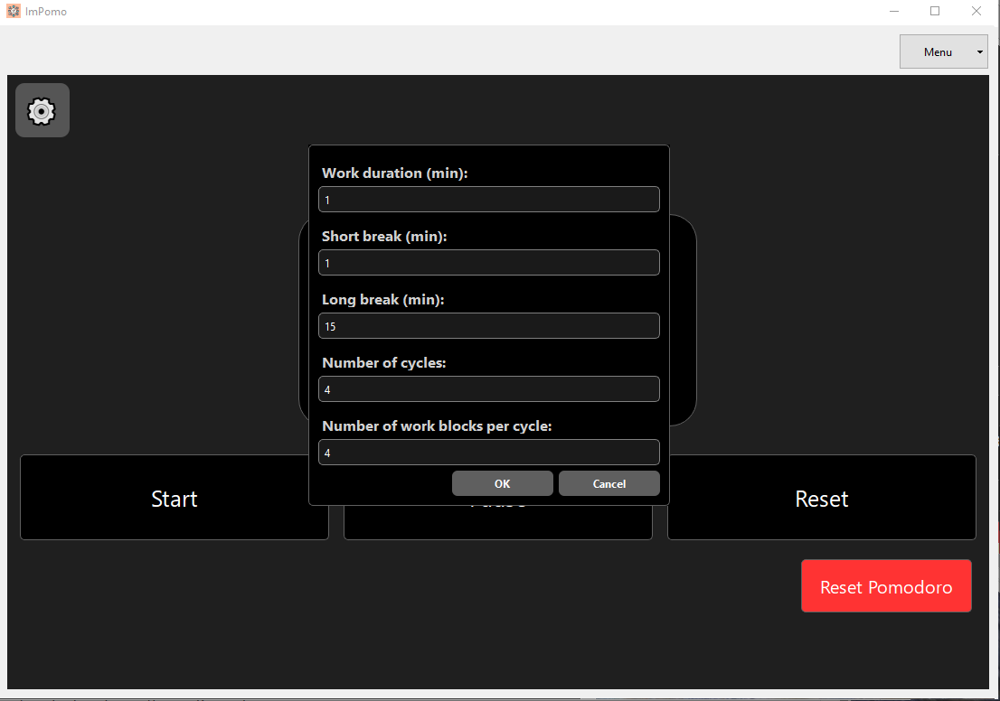

> _"Jako użytkownik chcę mieć możliwość zmiany długości czasu pracy i przerw w klasycznym trybie Pomodoro, aby dostosować ją do moich potrzeb."_

---

### **1. Zmiana długości pracy i przerwy przed rozpoczęciem (happy path)**

**Stan początkowy aplikacji:**  
Aplikacja uruchomiona. Tryb klasycznego Pomodoro aktywny. Sesja jeszcze nie została rozpoczęta.

**Kroki testowe:**
1. Wejście do ustawień klasycznego Pomodoro.
2. Zmiana czasu pracy z 25 minut na 1 min.
3. Zmiana czasu przerwy z 5 minut na 1 min.
4. Zapisanie zmian.
5. Uruchomienie sesji.

**Oczekiwany rezultat testu:**  
Timer uruchamia się z ustawionym czasem 1 min pracy i po jego zakończeniu automatycznie przechodzi do minutowej przerwy.

**Rzeczywisty rezultat testu:**  
*taki jak oczekiwany*

  

**Rezultat testu (zaliczony / niezaliczony):**  
*zaliczony*

**Stan końcowy aplikacji:**  
Aktywna sesja z czasem pracy 1 min i minutową przerwą.

---

### **2. Zmiana parametrów w trakcie sesji (scenariusz alternatywny)**

**Stan początkowy aplikacji:**  
Aktywna sesja klasycznego Pomodoro, timer odlicza czas.

**Kroki testowe:**
1. Wejście do ustawień podczas trwania aktywnego bloku pracy.
2. Zmiana czasu pracy z 25 minut na 15 minut.
3. Zapisanie zmian.

**Oczekiwany rezultat testu:**  
Timer resetuje się do nowo ustawionej wartości (15 minut). Odliczanie rozpoczyna się od nowa – licznik pokazuje pełne 15 minut.

**Rzeczywisty rezultat testu:**  
*taki jak oczekiwany*

**Rezultat testu (zaliczony / niezaliczony):**  
*zaliczony*

**Stan końcowy aplikacji:**  
Timer działa zgodnie z nowymi ustawieniami, sesja kontynuowana od początku nowego bloku pracy.
