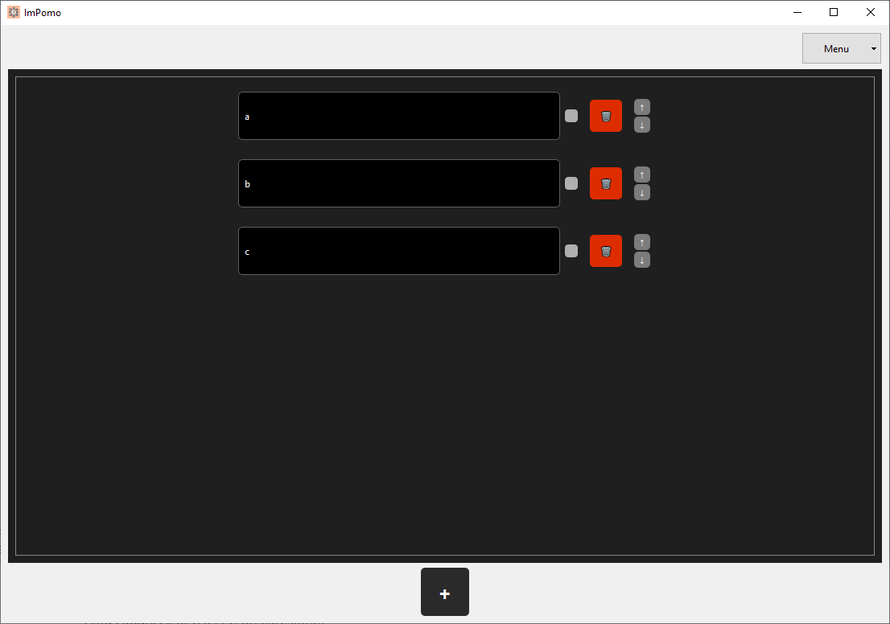
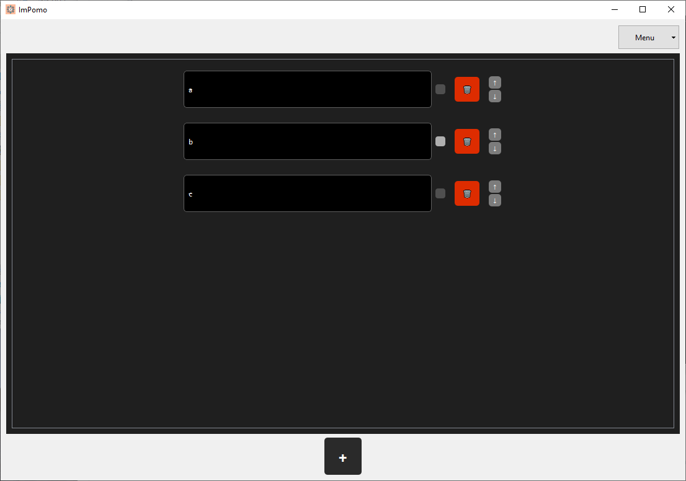

> _"Jako użytkownik chcę móc oznaczać zadanie jako ukończone poprzez przekreślenie go, aby lepiej śledzić postępy w pracy."_

---

### **1. Oznaczenie zadania jako ukończone (happy path)**

**Stan początkowy aplikacji:**  
Lista ToDo zawiera trzy zadania: A, B, C; żadne z nich nie zostało jeszcze oznaczone jako ukończone.

**Kroki testowe:**  
1. Dla zadania A i C kliknięcie checkboxów po prawej stronie pola tekstowego zadania.

**Oczekiwany rezultat testu:**  
Zadania A i C zostają wizualnie oznaczone jako ukończone (przekreślone).  
Zadanie B pozostaje niezmienione.

**Rzeczywisty rezultat testu:**  

  

  

**Rezultat testu (zaliczony / niezaliczony):**  
*zaliczony*

**Stan końcowy aplikacji:**  
Lista zadań: A, B, C (A i C przekreślone)

---

### **2. Próba oznaczenia ukończonego zadania jako nieukończone (scenariusz alternatywny)**

**Stan początkowy aplikacji:**  
Lista ToDo zawiera trzy zadania: A, B, C.  
Zadania A i C są przekreślone.

**Kroki testowe:**  
1. Ponowne kliknięcie checkboxów przy zadaniach A i C.

**Oczekiwany rezultat testu:**  
Zadania A i C nie są już przekreślone.

**Rzeczywisty rezultat testu:**  

  

  

**Rezultat testu (zaliczony / niezaliczony):**  
*zaliczony*

**Stan końcowy aplikacji:**  
Lista zadań: A, B, C; żadne zadanie nie jest przekreślone.
