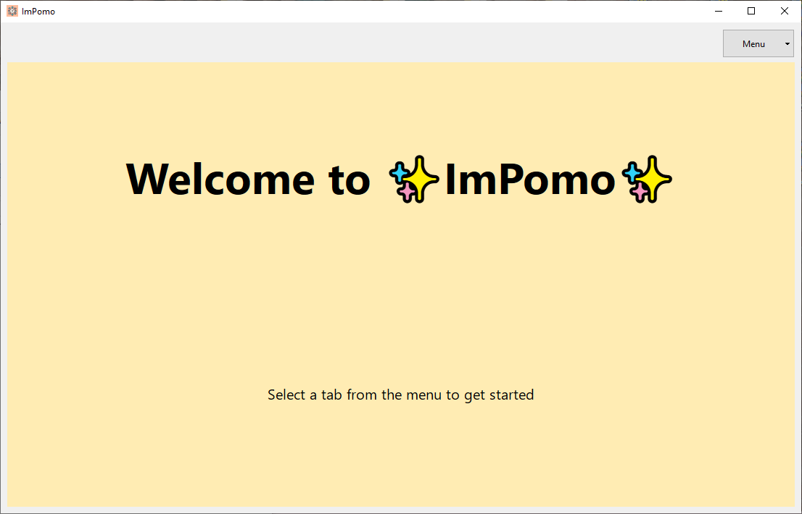
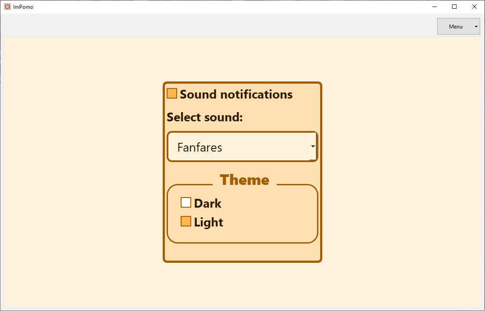
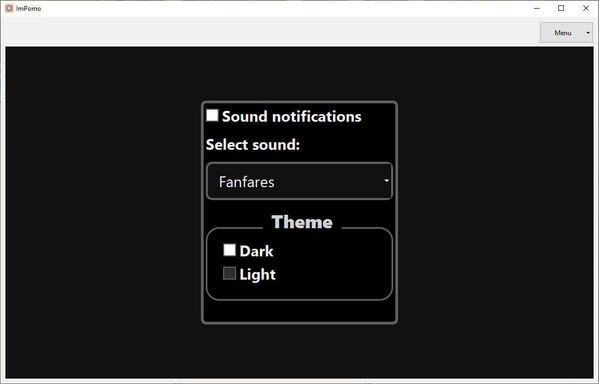
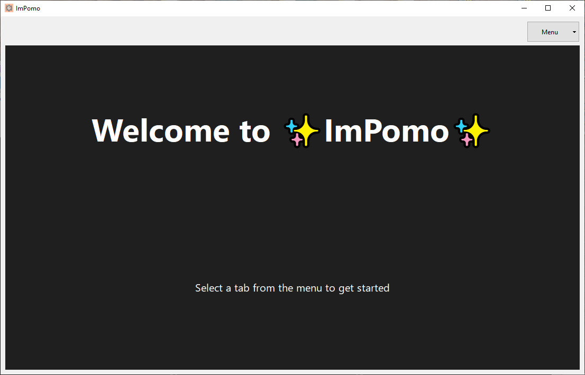

> _"Jako użytkownik chcę mieć możliwość ustawienia trybu ciemnego, aby zmniejszyć zmęczenie oczu podczas korzystania z aplikacji."_

---

### **1. Przełączenie z trybu jasnego na ciemny (happy path)**

**Stan początkowy aplikacji:**  
Aplikacja działa w trybie jasnym (ustawionym wcześniej ręcznie w ustawieniach).

**Kroki testowe:**  
1. Przejście do ustawień i wybór „Dark” w sekcji „Themes”.  
2. Obserwacja zmiany motywu.  
3. Zamknięcie i ponowne uruchomienie aplikacji.

**Oczekiwany rezultat testu:**  
Aplikacja przełącza się na tryb ciemny bez opóźnień oraz po ponownym uruchomieniu pozostaje w wybranym motywie.  
Wszystkie zakładki aplikacji poprawnie stosują nowy motyw.

**Rzeczywisty rezultat testu:**  

  

  

  

  

**Rezultat testu (zaliczony / niezaliczony):**  
*zaliczony*

**Stan końcowy aplikacji:**  
Aplikacja działa w trybie ciemnym.

---

### **2. Przełączenie z trybu ciemnego na jasny (scenariusz alternatywny)**

**Stan początkowy aplikacji:**  
Aplikacja działa w trybie ciemnym (ustawionym wcześniej ręcznie w ustawieniach).

**Kroki testowe:**  
1. Przejście do ustawień i wybór „Light” w sekcji „Themes”.  
2. Obserwacja zmiany motywu.  
3. Zamknięcie i ponowne uruchomienie aplikacji.

**Oczekiwany rezultat testu:**  
Aplikacja przełącza się na tryb jasny bez opóźnień oraz po ponownym uruchomieniu pozostaje w wybranym motywie.  
Wszystkie zakładki aplikacji poprawnie stosują nowy motyw.

**Rzeczywisty rezultat testu:**  

  

  

  

  

**Rezultat testu (zaliczony / niezaliczony):**  
*zaliczony*

**Stan końcowy aplikacji:**  
Aplikacja działa w trybie jasnym.
